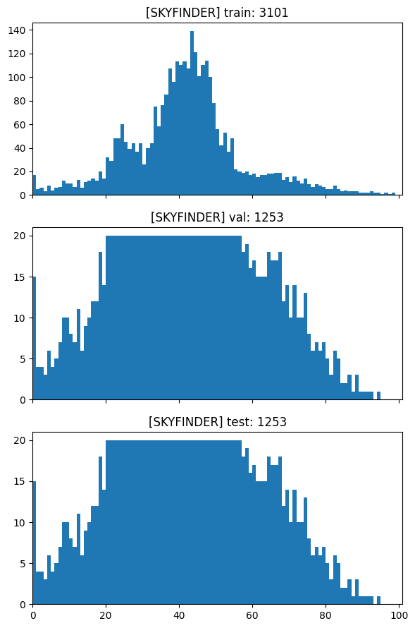

## An Exploration of Deep Imbalanced Regression on the SkyFinder Dataset

#### Introduction
This project is an adaptation of the following code: [Deep Imbalanced Regression](https://github.com/YyzHarry/imbalanced-regression) to see how it can be replicated and applied to a wide range of datasets. For this exploration specifically, we will explore how well Deep Imbalanced Regression works on the [SkyFinder Dataset](https://cs.valdosta.edu/~rpmihail/skyfinder/).

#### Data
The data is specifically a subset of all images from four fixed cameras: CamIds 3395, 4584, 5021, and 10870. The entire dataset was not used due to limitations in compute power/GPUs. The metadata file was used to train, test, and validate our models. The data and other supplementary materials can be downloaded from the website where SkyFinder is posted [here](https://cs.valdosta.edu/~rpmihail/skyfinder/).


#### Initial Investigation
I first familiarized myself with the concept of Deep Imbalanced Regression, and the two solutions proposed in the paper: Label Distribution Smoothing (LDS) and Feature Distribution Smoothing (FDS). From reading the paper and associated blog post, I delved into what these methods were, how they were designed, what these methods were trying to accomplish, and what gaps in current modeling they were trying to fill. 
Then after looking through the source code from [this Git repo](https://github.com/YyzHarry/imbalanced-regression), I successfully ran `tutorial.ipynb` to get a real-time feel of what the code was doing as it ran. Following the READMEs, I also ran `train.py` on some of the example datasets (`agedb-dir`, `nyud2-dir`), albeit running with a much lower epoch input and only a subset of the data.

From there, I identified the `agedb-dir` code as a solid template for my exploration of the SkyFinder Dataset. 

As LDS and FDS work more so on continuous labeling, I explored the metadata of the SkyFinder dataset to determine what metrics I could predict from a model with LDS and/or FDS applied. After playing around with several of the metrics in the .CSV file, I settled on 'clouds' – decimal values between 0 and 1 representing the coverage of clouds in an image. I multiplied all values by 100 to get percent labels of cloud coverage for easier/more intuitive calculations. After splitting up the data into "train", "test", and "validation" sets, the distribution seemed decent enough to attempt to model cloud coverage on my dataset. There are clearly defined "many-shot", "medium-shot", and "low-shot" regions, while the test and validation sets could still be relatively uniform.  



#### What I Ran
1. I first pre-processed the data: 

```bash
python3 preprocess_data.py
```

2. I compiled various files to set up the training of the model – defining the ResNet model architecture in `resnet.py`, loading + initializing/weighting the dataset in `dataloader.py`, FDS in `fds.py`, the loss functions in `loss.py`, utility functions in `utils.py`, data augmentions in `skyfinder_transforms.py`, and finally preparing my model to run from `train.py`. I adapted the code from the original Git repository specifically for the SkyFinder dataset and my personal GPU environment.

3. I chose to ran Ran my models against the training, validation, and test sets as delineated in the original Git repo's READMEs:

    a. Inverse Weighting

    ```bash
    python3 train.py --reweight inverse --data_dir 'data' --batch_size 8 --device 'mps'
    ```

    b. Square-Root Inverse Weighting

    ```bash
    python3 train.py --reweight sqrt_inv --data_dir 'data' --batch_size 8 --device 'mps'
    ```

    c. LDS Only
    ```bash
    python3 train.py --reweight sqrt_inv --lds --lds_kernel gaussian --lds_ks 5 --lds_sigma 2 --fds --fds_kernel gaussian --fds_ks 5 --fds_sigma 2 --data_dir 'data' --batch_size 8 --device 'mps'
    ```

    d. FDS Only
    ```bash
    python3 train.py  --fds --fds_kernel gaussian --fds_ks 5 --fds_sigma 2 --data_dir 'data' --batch_size 8 --device 'mps'
    ```

    e. LDS + FDS Combined
    ```bash
    python3 train.py --reweight sqrt_inv --lds --lds_kernel gaussian --lds_ks 5 --lds_sigma 2 --fds --fds_kernel gaussian --fds_ks 5 --fds_sigma 2 --data_dir 'data' --batch_size 8 --device 'mps'
    ```

#### Summary of Results
The lowest metric value has been bolded in each table.

##### Overall
| Method | Overall MSE | Overall L1 | G-Mean |
| :--- | :---: | :---: | :---: |
| **Inverse** | 334.075 | 13.570 | 8.809 |
| **Sqrt_Inv** | 126.944 | 8.736 | 5.551 |
| **LDS** | 119.897 | 8.359 | 5.173 |
| **FDS** | **99.836** | **7.638** | **4.823** |
| **LDS + FDS** | 137.828 | 8.783 | 5.435 |

##### Detailed Shot Metrics (MSE / L1 / Geometric-Mean)

| Method | Many-Shot | Medium-Shot | Few-Shot |
| :--- | :--- | :--- | :--- |
| **Inverse** | 127.7 / 9.7 / 7.3 | 177.4 / 11.2 / 8.4 | 337.1 / 13.6 / 8.8 |
| **Sqrt_Inv** | 45.8 / 4.4 / 3.1 | 29.9 / 5.1 / 4.8 | 128.2 / 8.8 / 5.6 |
| **LDS** | 71.0 / 5.0 / 2.9 | **8.2 / 2.7 / 2.4** | 120.9 / 8.4 / 5.2 |
| **FDS** | **27.4 / 3.6 / 2.0** | 33.0 / 4.8 / 3.7 | **100.9 / 7.7 / 4.9** |
| **LDS + FDS** | 69.6 / 4.8 / 2.9 | 37.4 / 5.2 / 4.2 | 139.0 / 8.8 / 5.5 |

#### Discussion of Results
Square-root inverse weighting, LDS, FDS, and LDS + FDS models all greatly outperformed my model with only inverse weighting.

Overall, FDS produced the lowest MSE, L1 loss, and geometric mean out of all methods – especially for the "many-shot" and "few-shot" regions. This suggests that when trying to predict cloud coverage, a highly visual characteristic, looking at similarities between visual features of images w/ similar cloud coverage percentages helped train the model for both samples with several examples and few examples to reference. 

LDS also drastically reduced the value of all metrics, but shined the most in medium-shot samples, where the MSE, L1, and G-Mean were lowest out of all methods. However, it did relatively poorly in the "many-shot" regions (with a greater MSE and L1 than sqrt-inverse weighting), indicating that it may be "blurring" labels too far on a smaller dataset. 

Interestingly, LDS and FDS combined produced worse results than when run by themselves, even performing worse than simply using square-root inverse weighting. This suggests that there may be over-smoothing of the data with both FDS and LDS applied, especially on a smaller dataset. 

#### Limitations
Personal compute power was definitely the limiting factor in this exploration. Using a 14-inch Macbook Pro without access to any compute clusters or local GPUs, I was limited to the default MPS mode GPU or running the model on my CPU, which as expected, proved to be exponentially slower than MPS mode. As I was not using CUDA, I commented out/updated several lines of code that referenced it in order for my code to run, and to make my code more flexible.

As a result of compute power limitations, I 1. Did not use the entire dataset (choosing 4 CamIds instead of the total of 53), 2. Greatly reduced the # of epochs I ran per each model, and 3. Used a lower batch size of 8 instead of the default 32. Adding all factors could've definitely lowered the error and bias on all models and make the error estimates more stable, especially as I would likely have more example images in few-shot regions.

Despite this, it still took ~1 hour each to run a model (albeit I have run a few overnight). Due to time constraints, I did not explore other metrics to run my model against, but did note down a few variables that had distributions worth exploring in the future.


#### Future Directions
Delving into the nitty gritty of both LDS and FDS, and also applying what I had learned, has been an incredible learning experience. I would definitely like to continue exploring how it works given more compute power (and maybe financial resources).

I would like to explore the following:
- Running my models on more epochs (>50). In the past, albeit on much smaller models, I've run my models on epochs of 100+
- Comparing model performance on other metrics measured in the metadata. Other than "clouds", the following metrics seemed to follow a distribution wherein "many-shot", "medium-shot", and "few-shot" regions are clearly identifiable:
    - fog (skews right quite a bit)
    - bright
    - beautiful (more uniform distribution)
    - soothing (also need to further investigate what this is actually a measure of)
    - dirty (also need to further investigate what this is actually a measure of)
    - sunrisesunset
    - dawndusk
- Tweaking the kernel size (larger or smaller) to identify what minimizes my loss
- More data augmentations! I had copied a few additional data augmentations from the `nyu2-dir`, but didn't end up using them to transform my dataset. I would like to see how adding more transforms would make my model more robust, especially for more few-shot regions, but also to what threshold they would muddy the waters too much and actually increase the error. 